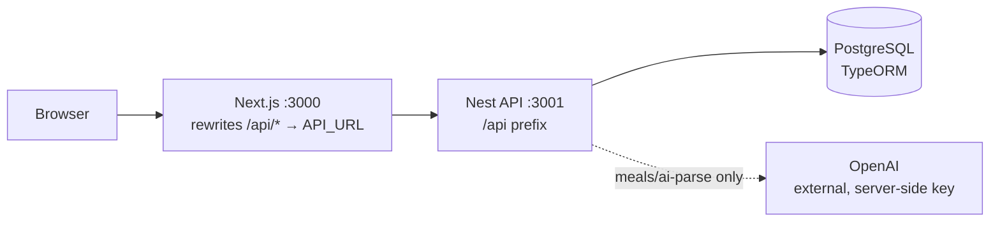
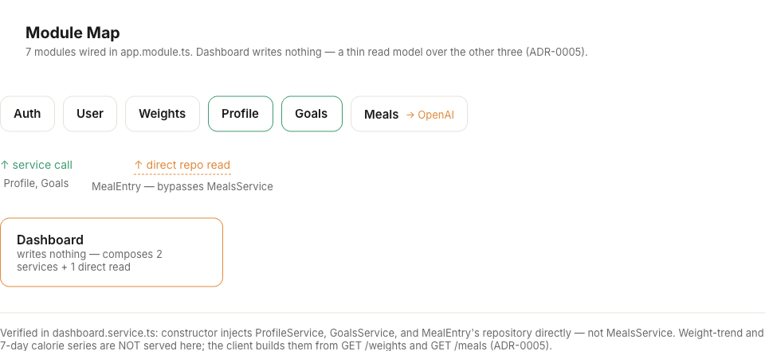
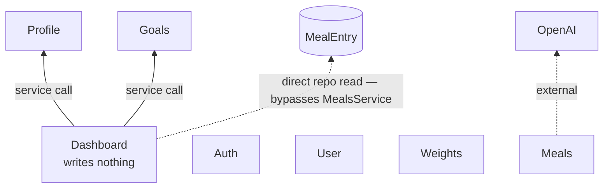
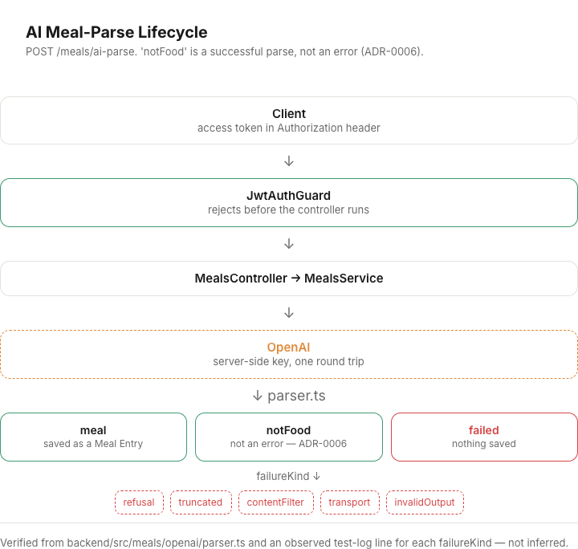
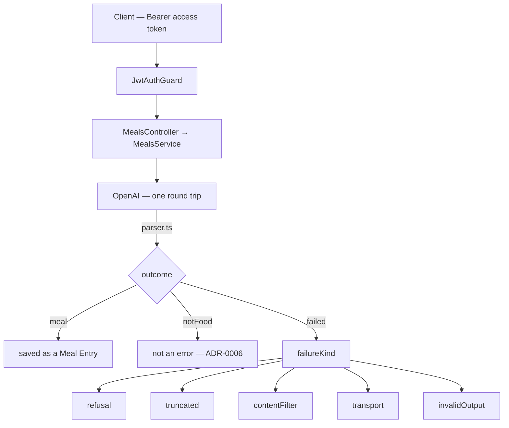
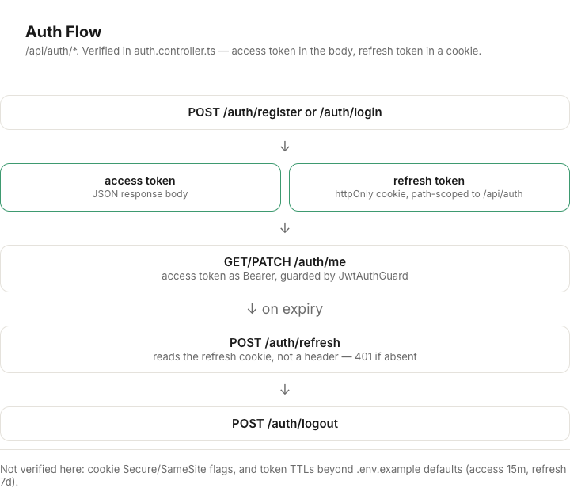
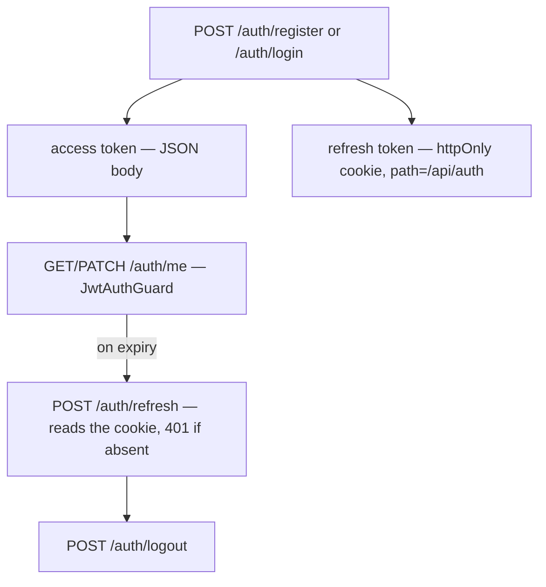

# Architecture (#42)

Four diagrams, each verified against the running code (paths and behavior cited
inline), not inferred from naming. Each has a Mermaid block (renders natively
on GitHub — in this file, in issues, in PR descriptions before anything is
pushed) and a PNG under `docs/architecture/` (renders as an image in the repo
and in a PR body once the branch is pushed).

## System context

Auth: access token in the JSON response body, refresh token in an httpOnly
cookie. Checked at the Nest API boundary (`JwtAuthGuard`), not by Next.js.

## Module map

7 modules wired in `app.module.ts`. `DashboardService`'s constructor injects
`ProfileService`, `GoalsService`, and `MealEntry`'s repository directly — not
`MealsService`. That's a real, non-obvious coupling: Dashboard shares a table
with Meals without going through its service layer. Weight-trend and 7-day
calorie series are **not** served here; the client builds them from
`GET /weights` and `GET /meals` (ADR-0005). Auth, User and Weights aren't read
by Dashboard at all.

## AI meal-parse lifecycle

`outcome: 'meal' | 'notFood' | 'failed'` — from `backend/src/meals/openai/parser.ts`.
The five `failureKind` values are copied from an observed test-log line for
each, not guessed.

## Auth flow

Verified in `auth.controller.ts`. **Not verified:** cookie `Secure`/`SameSite`
flags, and token TTLs beyond the `.env.example` defaults (access 15m, refresh 7d).

---

Source file (editable): [Paper — Foodnote Design System](https://app.paper.design/file/01KXDP0BGYQ1SYCCDP0E5XP2ED/1-0),
artboards `ARCH01`–`ARCH04`.
