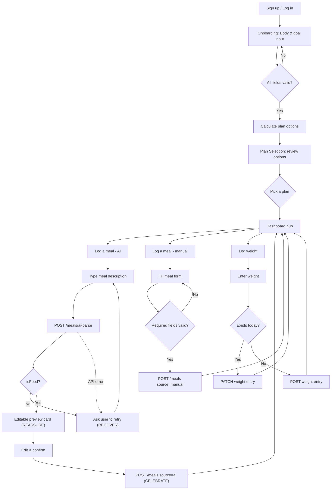

# FoodNote — Design System Summary

Source of truth: [Paper file "Foodnote Design System"](https://app.paper.design/file/01KXDP0BGYQ1SYCCDP0E5XP2ED/1-0). This doc is a static snapshot for the repo — edit designs in Paper, not here.

Scope: the core loop only — **onboarding → plan selection → AI meal logging → dashboard**. Manual meal logging and weight logging exist as flow branches (see diagram) but were not designed past Stage 00; they reuse the same patterns as AI meal logging.

## Process

Four inherited stages per screen, each evolving the last:

1. **Product Flow (F)** — places, decisions, actions, edge states. No screens, no branding.
2. **Wireframes (W)** — boxes + labels. Spatial structure only.
3. **Low fidelity (L)** — real copy, shadcn semantics, grayscale + one functional accent (orange), states.
4. **High fidelity (H)** — final brand color, real mascot art, polish, interaction annotations.

Only Stage F and Stage H are exported here as images. Wireframe and low-fi stages exist in Paper only — open the file to see the intermediate steps.

## Product Flow

Mobile core loop (onboarding through AI meal logging, all branches and edge states):

Desktop scope is dashboard-only (see below) — onboarding, plan selection, and meal logging are mobile-only; desktop reuses the mobile flows for those actions rather than redesigning them.

Static exports: [`flow-mobile.webp`](./exports/flow-mobile.webp) · [`flow-desktop.webp`](./exports/flow-desktop.webp)

## Screens (High Fidelity)

| Screen | Parent flow node | Export |
|---|---|---|
| Onboarding | F01 | [`h01-onboarding.webp`](./exports/h01-onboarding.webp) |
| Plan Selection | F02 | [`h02-plan-selection.webp`](./exports/h02-plan-selection.webp) |
| Dashboard (mobile) | F03 | [`h03-dashboard-mobile.webp`](./exports/h03-dashboard-mobile.webp) |
| Meal Log — Input | F04 | [`h04-meal-log-input.webp`](./exports/h04-meal-log-input.webp) |
| Meal Log — Loading | F04 | [`h05-meal-log-loading.webp`](./exports/h05-meal-log-loading.webp) |
| Meal Log — AI Preview | F05 | [`h06-meal-log-ai-preview.webp`](./exports/h06-meal-log-ai-preview.webp) |
| Meal Log — Not Food | F04 edge | [`h07-meal-log-not-food.webp`](./exports/h07-meal-log-not-food.webp) |
| Dashboard (desktop) | F-D | [`h-desktop-dashboard.webp`](./exports/h-desktop-dashboard.webp) |

Mobile is 390px (iPhone), designed first — desktop scope was deliberately limited to the Dashboard only, scaled up as a sidebar + multi-column chart grid rather than a stretched mobile layout.

## Design tokens

| Token | Value | Use |
|---|---|---|
| `--color-primary` | `#F5A65C` | Primary actions, active states — the one functional accent |
| `--color-secondary` | `#5BB98C` | Positive/success states (weight loss, actual-vs-projected) |
| `--color-tertiary` | `#F4907E` | Decorative only, mascot-adjacent — never UI state |
| `--color-error` | `#D64545` | Validation errors, destructive states only |
| `--color-bg` / `--color-surface` | `#FDFDFB` / `#FFFFFF` | Ground / card surfaces |
| `--font-display` | Fredoka | Headlines, big numbers |
| `--font-sans` | Inter | UI, body, data labels |

Full token set (spacing, radius, type scale) lives in the Paper file's token panel, not duplicated here to avoid drift.

## Mascot usage

Source assets: [`docs/design/mascot/`](./mascot/). Each appearance is a deliberate functional choice, not decoration — mascot never appears on routine screens (forms, headings, routine saves).

| Emotive | Asset | Used for | Job |
|---|---|---|---|
| Writing / attentive | `foodnote_mascot_logo.png` | AI parsing (loading) | GUIDE — reduce uncertainty during a first-time wait |
| Nervous / sweat | `foodnote_mascot_emotives009.webp` | AI preview confidence note | REASSURE — estimate is uncertain, review before saving |
| Crying | `foodnote_mascot_emotives004.webp` | "Not food" edge state | RECOVER — gentle redirect, not an error |
| Excited / laughing | `foodnote_mascot_emotives001.webp` | Meal-saved toast (implementation note only, not a static screen) | CELEBRATE — quiet, since it happens every meal |
| Sleeping | `foodnote_mascot_emotives005.webp` | Empty dashboard (flow-only, not exported as a screen) | ACCOMPANY — nothing logged yet |

## Implementation notes (from High Fidelity annotations)

- **Drawer, not push navigation**: "Log a meal" should open as a shadcn Drawer over the dashboard, not a full route change — keeps today's totals as visible ground to return to.
- **Sonner over blocking confirms**: on save, dismiss the Drawer and show a Sonner toast ("Meal saved") with Undo rather than a blocking dialog.
- **NumberFlow**: the remaining-kcal figure, progress bar, and macro totals should animate with NumberFlow on every save/edit so updates read as caused by the action just taken, not a page refresh.
- **Tabular numbers**: all calorie/weight/macro figures use `font-variant-numeric: tabular-nums` so digits don't shift width as they change.

## What's not here

- Manual meal logging and weight logging screens (flow-mapped, not wireframed/designed — out of the requested scope).
- Wireframe (W) and Low-fidelity (L) stage artboards (21 total artboards in Paper; only Stage F and H are exported as static images here).
- Settings, auth, and any screen outside the requested onboarding → plan selection → AI meal logging → dashboard loop.
